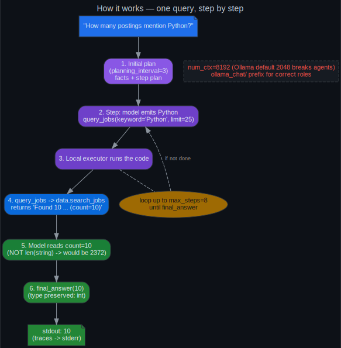
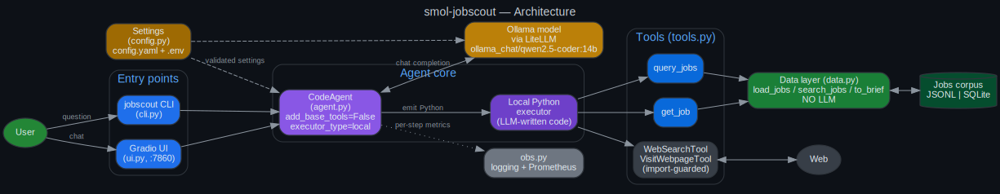
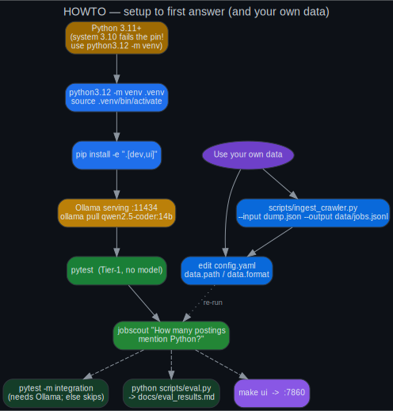
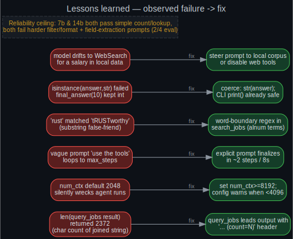
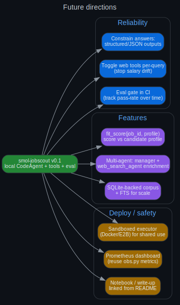

# smol-jobscout

<p align="center">
  <a href="https://github.com/danindiana/smol-jobscout/actions/workflows/ci.yml"></a>
  
  
  
  
  
  
  
  
  
  
</p>

> A **local-first [smolagents](https://github.com/huggingface/smolagents) `CodeAgent`** that answers
> natural-language questions over a corpus of crawled job postings — *"which remote roles mention
> Parquet?"*, *"summarize the top 3 Python infra roles"*, *"what salary ranges are listed?"* — with
> an optional web-search-and-summarize path.

**It runs entirely on a single consumer GPU via [Ollama](https://ollama.com) — no cluster, no paid
API key.** The agent only plans and summarizes; a deterministic, pure-Python data layer does the
actual filtering. That separation is the whole point: the LLM is the orchestrator, not the database.

---

## Table of contents

- [Why this exists](#why-this-exists)
- [60-second quickstart](#60-second-quickstart)
- [Example run](#example-run)
- [How it works](#how-it-works)
- [Architecture](#architecture)
- [HOWTO — setup, your own data, deploy](#howto--setup-your-own-data-deploy)
- [Configuration](#configuration)
- [Model note (7b vs 14b)](#model-note-7b-vs-14b)
- [Evaluation — real numbers](#evaluation--real-numbers)
- [Lessons learned (the honest tricky parts)](#lessons-learned-the-honest-tricky-parts)
- [Security note](#security-note-read-this)
- [Testing](#testing)
- [Project layout](#project-layout)
- [Future directions](#future-directions)
- [License](#license)

---

## Why this exists

Most "AI agent" demos assume a frontier cloud model and a credit card. This one assumes the opposite:
limited VRAM, a model you already run locally, and real data infrastructure sitting on disk. It is a
focused, single-purpose agent — **not a framework** — built to be cloned, verified, and read end to
end. No fine-tuning, no training, no multi-tenant service, no cloud lock-in.

- **Primary goal:** a reproducible one-command demo — a local LLM agent that reads crawled job
  postings (JSONL or SQLite) and answers questions about them.
- **Secondary goal:** a `web_search` + `visit_webpage` path so the agent can enrich a posting from
  its URL.
- **Constraint, deliberately kept:** it must run on one consumer GPU. That constraint is the story.

---

## 60-second quickstart

```bash
git clone https://github.com/danindiana/smol-jobscout && cd smol-jobscout

# IMPORTANT: needs Python 3.11+. If your system python3 is older, use python3.12 explicitly.
python3.12 -m venv .venv && source .venv/bin/activate
pip install -U pip && pip install -e ".[dev,ui]"

# Ollama must be serving on :11434 with the model pulled:
ollama pull qwen2.5-coder:14b

jobscout "How many postings mention Python?"
```

No `.env` is required — it works out of the box against the bundled `data/sample_jobs.jsonl`
(15 synthetic postings).

---

## Example run

```text
$ jobscout "Using only the local job postings, name one company hiring for a Rust role."
─ Executing parsed code: ──────────────────────────────────────────────
  results = query_jobs(keyword="Rust", limit=25)
  final_answer("Ferroline")
────────────────────────────────────────────────────────────────────────
Ferroline
```

The final answer goes to **stdout** (pipeable); the step/tool trace goes to **stderr**, including one
structured log line per agent step:

```text
INFO  step=1 tool=python_interpreter,query_jobs,final_answer args=results = query_jobs(...) duration_ms=2300.0
```

Set `obs.metrics_port` in `config.yaml` to also export Prometheus counters (`jobscout_runs_total`,
`jobscout_steps`, `jobscout_tool_calls_total{tool=}`, `jobscout_run_latency_seconds`).

---

## How it works

A single question flows through plan → code-action → tool call → read result → `final_answer`,
looping up to `max_steps` until the agent finalizes:



The two non-obvious settings on this path — `num_ctx=8192` (Ollama's 2048 default silently breaks
agents) and the `ollama_chat/` LiteLLM prefix (correct role handling) — are highlighted in red
because they are the difference between "works" and "mysteriously does nothing."

---

## Architecture

CLI/UI → `CodeAgent` → { Ollama model via LiteLLM, tools → local job corpus / web }. The data layer
(`search_jobs`) is pure Python and contains **no LLM** — it is the deterministic backbone the agent's
tools call.



See [`docs/ARCHITECTURE.md`](docs/ARCHITECTURE.md) for a per-component write-up and the mermaid source.

---

## HOWTO — setup, your own data, deploy



**Point it at your own data** — edit `config.yaml` (`data.path` / `data.format`), or convert a crawler
dump into the canonical schema:

```bash
python scripts/ingest_crawler.py --input crawler_dump.json --output data/jobs.jsonl
# then set data.path: "data/jobs.jsonl" in config.yaml
```

`scripts/ingest_crawler.py` documents the expected crawler record shape (title, company, location,
remote, url, posted_at, salary, text/description) and is tolerant of missing fields.

**Deploy (systemd, matches the author's stack):**

```bash
sudo cp -r . /opt/smol-jobscout
sudo cp deploy/jobscout-ui.service /etc/systemd/system/jobscout-ui@$(whoami).service
sudo systemctl daemon-reload && sudo systemctl enable --now jobscout-ui@$(whoami)
journalctl -u jobscout-ui@$(whoami) -f
```

A `deploy/Dockerfile` is also provided (run with `--network host` so the container reaches Ollama).
**If you expose this on a network, read the [security note](#security-note-read-this) first.**

---

## Configuration

Everything lives in `config.yaml`, loaded + validated by `config.py` (pydantic). CLI flags
(`--backend`, `--model`, `--data`) override it per-invocation.

| Key | Default | Why it matters |
|---|---|---|
| `model.model_id` | `qwen2.5-coder:14b` | the agent brain (see model note) |
| `model.num_ctx` | `8192` | **must be ≥ 4096** — 2048 silently wrecks agent runs |
| `model.temperature` | `0.2` | low temp → fewer malformed code-actions |
| `agent.max_steps` | `8` | hard cap on the reason/act loop |
| `agent.planning_interval` | `3` | periodic re-planning; `null` to disable |
| `agent.additional_authorized_imports` | `json, re, statistics, datetime` | keep tight (security) |
| `agent.enable_web_tools` | `true` | `WebSearchTool` + `VisitWebpageTool` |
| `data.path` / `data.format` | `data/sample_jobs.jsonl` / `jsonl` | the corpus (`jsonl` or `sqlite`) |
| `obs.metrics_port` | `null` | set (e.g. `9109`) to expose Prometheus metrics |

---

## Model note (7b vs 14b)

The spec's recommended `qwen2.5-coder:7b-instruct` tag was **not present** on the build host, so this
repo defaults to **`qwen2.5-coder:14b`** for more reliable agentic behavior. A smaller
**`qwen2.5-coder:7b`** "fast" profile is available:

```bash
jobscout --model qwen2.5-coder:7b "List Python data-infra roles with salaries."
```

It is roughly **2× faster per step** but no more accurate on the hard prompts — see the eval below.

---

## Evaluation — real numbers

`scripts/eval.py` runs a handful of fixed (question → expected-substring) pairs against the live model
and writes a Markdown table. Run 2026-06-10 against the bundled sample corpus:

| Model | Pass rate | Latency range | Full table |
|---|---|---|---|
| `qwen2.5-coder:14b` (default) | **2/4** | 8–26 s | [`docs/eval_results.md`](docs/eval_results.md) |
| `qwen2.5-coder:7b` (fast) | **2/4** | 4–17 s | [`docs/eval_results_7b.md`](docs/eval_results_7b.md) |

Both sizes **reliably** pass the simple cases (count Python postings → `10`; name a Rust-hiring
company → `Ferroline`) and **both fail the same two harder prompts**. That consistency is the honest
finding, not a bug to paper over.

```bash
make eval                                 # 14b -> docs/eval_results.md
python scripts/eval.py --model qwen2.5-coder:7b --output docs/eval_results_7b.md
```

---

## Lessons learned (the honest tricky parts)

The full write-up — with specifics and numbers — is in
[`docs/LESSONS_LEARNED.md`](docs/LESSONS_LEARNED.md). The short version, as observed → fixed:



The headline one: the **very first live run returned `2372`**. The model had called `query_jobs`
correctly, then ran `len()` on the joined-string result and reported its *character count*. The fix
wasn't a better prompt — it was making the tool **emit the number** (`... (count=10)`) instead of
making the model derive it. Tool *output shape* drives behavior as much as docstrings do.

---

## Security note (read this)

`CodeAgent` **executes Python that the LLM writes, in-process, on the host.** With a local model and a
tight `additional_authorized_imports` allowlist the risk is bounded — but **never expose this agent to
untrusted input over a network without sandboxing.** For any shared/remote deployment, switch
`executor_type` to a sandboxed runner (Docker/E2B) and keep the import allowlist minimal. Do not put a
code-executing agent on an open port.

---

## Testing

Two tiers. Tier-1 runs in CI with no model; Tier-2 needs Ollama and is opt-in.

```bash
pytest                  # Tier-1: deterministic, no LLM (19 tests)
pytest -m integration   # Tier-2: builds the real agent; skips cleanly if Ollama is absent
ruff check src tests    # lint
```

- **Tier-1** covers the data layer (schema normalization, keyword/remote filters, brief length),
  the tools (`query_jobs`/`get_job`, count header, empty-result sentinel), config validation, and the
  `eval.py` / `ingest_crawler.py` scripts.
- **Tier-2** builds the real `CodeAgent` and asserts it calls a corpus tool and finalizes within
  `max_steps`. It **skips** (does not fail) when Ollama is unreachable or the model isn't pulled.

---

## Project layout

```
smol-jobscout/
├── src/smol_jobscout/      # config · model · data · tools · agent · cli · ui · obs
├── data/sample_jobs.jsonl  # 15 synthetic postings (runs out-of-the-box)
├── tests/                  # tier-1 (no model) + tier-2 integration
├── scripts/                # ingest_crawler.py · eval.py
├── deploy/                 # systemd unit · Dockerfile
├── docs/                   # ARCHITECTURE · LESSONS_LEARNED · eval_results · diagrams/
└── .github/workflows/ci.yml
```

---

## Future directions



Reliability (structured outputs, per-query web toggle, an eval gate in CI), features
(`fit_score(job_id, profile)`, a multi-agent manager + web-search worker, SQLite/FTS for scale), and
deploy/safety (sandboxed executor, a Prometheus dashboard over `obs.py`, a linked write-up).

---

## License

MIT — see [LICENSE](LICENSE).

---

<sub>Built to run on one consumer GPU, documented so a stranger can clone and verify it.
Diagrams are Graphviz; sources in [`docs/diagrams/*.dot`](docs/diagrams), rendered to `.svg` and `.png`.</sub>
