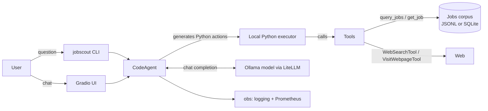

# Architecture

## Components

- **CLI (`cli.py`)** — argparse entry point registered as `jobscout`. Flags override
  `config.yaml`. Prints the final answer to stdout; traces go to stderr so stdout stays pipeable.
- **UI (`ui.py`)** — optional `GradioUI` over the same agent at `:7860`.
- **Config (`config.py`)** — pydantic `Settings`, loaded from `config.yaml` + `.env`. Warns on
  `num_ctx < 4096`, fails fast on a missing data path. `get_settings()` is the runtime singleton.
- **Model factory (`model.py`)** — `build_model()` returns a smolagents model for the chosen
  backend. Default: Ollama via `LiteLLMModel` with the `ollama_chat/` prefix and a raised `num_ctx`.
- **CodeAgent (`agent.py`)** — a smolagents `CodeAgent` that writes Python to call the tools.
  Executes locally; see the security note. `add_base_tools=False` — we add only what we need.
- **Tools (`tools.py`)** — `query_jobs` and `get_job` over the local corpus, plus import-guarded
  `WebSearchTool`/`VisitWebpageTool`. Docstrings + type hints drive model behavior.
- **Data layer (`data.py`)** — `load_jobs` (JSONL/SQLite, tolerant), `search_jobs` (pure-Python
  filter, no LLM), `to_brief` (compact rendering to respect the context budget).
- **Observability (`obs.py`)** — rich structured logging; optional Prometheus exporter
  (runs, steps, tool calls, latency histogram, errors).

The deterministic data/tool layer is the backbone; the LLM only orchestrates and summarizes.
